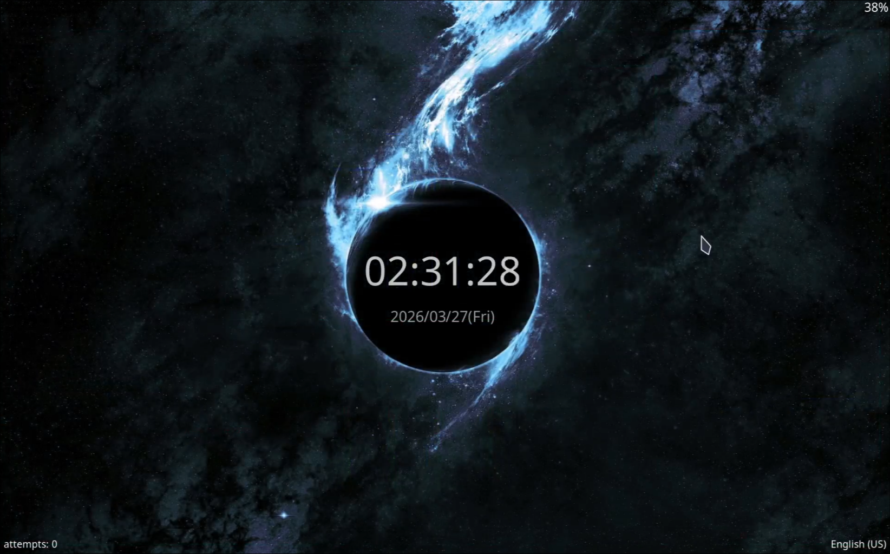
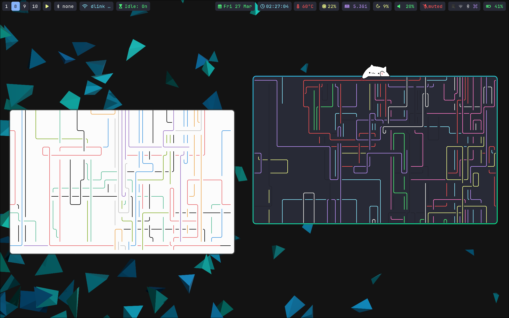

# dotfiles

<p align="center">
    
    
    
    
</p>

```bash
git clone https://github.com/simta1/dotfiles.git ~/dotfiles
mkdir -p ~/.config 
sudo nixos-rebuild switch --flake ~/dotfiles#nixos
```


```bash
git clone https://github.com/pohlrabi404/Hyprfoci
cd Hyprfoci
nix-shell -p \
    pkg-config \
    gcc \
    gnumake \
    hyprland \
    hyprutils \
    hyprlang \
    hyprgraphics \
    hyprcursor \
    aquamarine \
    pixman \
    libdrm \
    pango \
    cairo \
    libinput \
    systemd \
    wayland \
    wayland-protocols \
    libxkbcommon \
    libGL

make all
```
