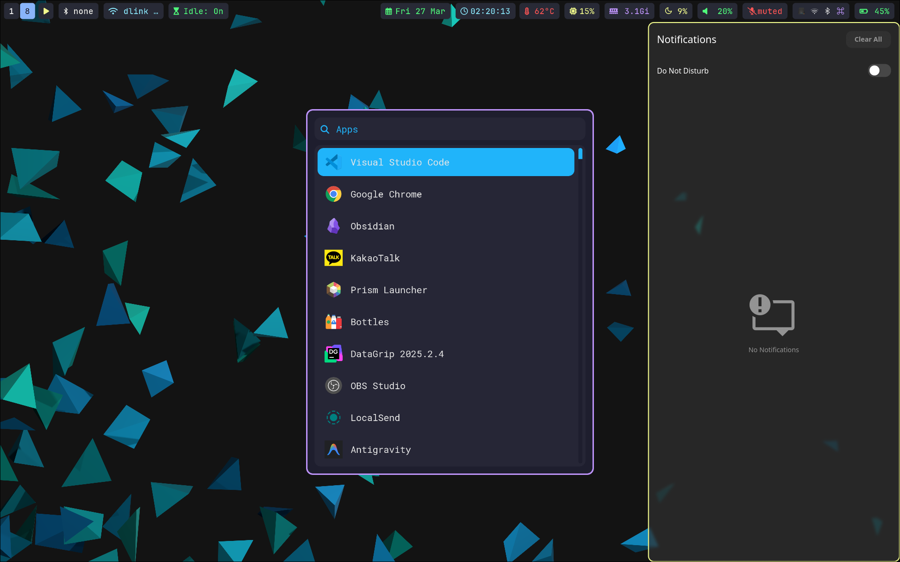
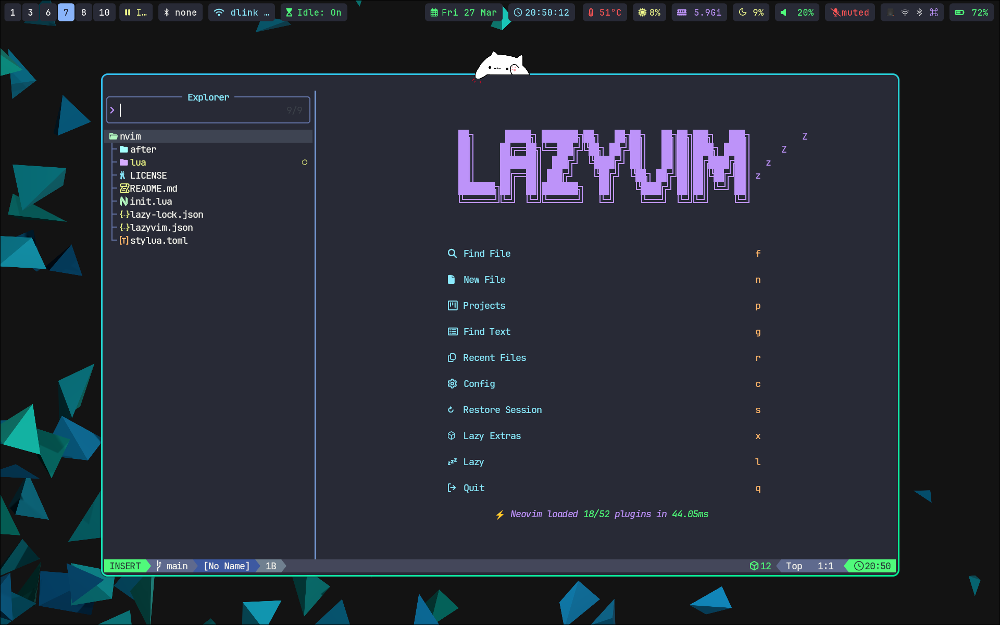

# dotfiles

<p align="center">
    
    
    
    
</p>

## Setup
```bash
git clone https://github.com/simta1/dotfiles.git ~/dotfiles
mkdir -p ~/.config 
sudo nixos-rebuild switch --flake ~/dotfiles#nixos
```

## System configs
```bash
sudo cp -i ~/dotfiles/etc/conf.d/* /etc/conf.d/
sudo cp -i ~/dotfiles/etc/modprobe.d/* /etc/modprobe.d/
sudo cp -i ~/dotfiles/etc/security/faillock.conf /etc/security/faillock.conf
sudo cp -i ~/dotfiles/etc/pam.d/* /etc/pam.d/
```

## Scripts
```bash
stow -v bin

mkdir -p ~/.config/systemd/user
stow -v systemd

systemctl --user daemon-reload
systemctl --user enable --now battery-alert.timer
```

## Applications
```bash
# vscode
yay -S visual-studio-code-bin
stow -v Code

# environment.d
stow -v environment.d

# sway
sudo pacman -S grim slurp imagemagick
sudo pacman -S polkit-gnome fprintd
yay -S swaylock-effects
stow -v sway

# bottles
sudo pacman -S flatpak
flatpak remote-add --if-not-exists flathub https://flathub.org/repo/flathub.flatpakrepo
flatpak install flathub com.usebottles.bottles

# hyprland
sudo pacman -S udiskie xdg-desktop-portal-hyprland xdg-desktop-portal-gtk hyprpolkitagent xorg-xwayland pass pass-otp

# gnupg
stow -v gnupg

# wezterm
stow -v wezterm

# zed
stow -v zed

# zellij
stow -v zellij
```

## sddm theme
```bash
# https://github.com/Keyitdev/sddm-astronaut-theme
sh -c "$(curl -fsSL https://raw.githubusercontent.com/keyitdev/sddm-astronaut-theme/master/setup.sh)"
```
